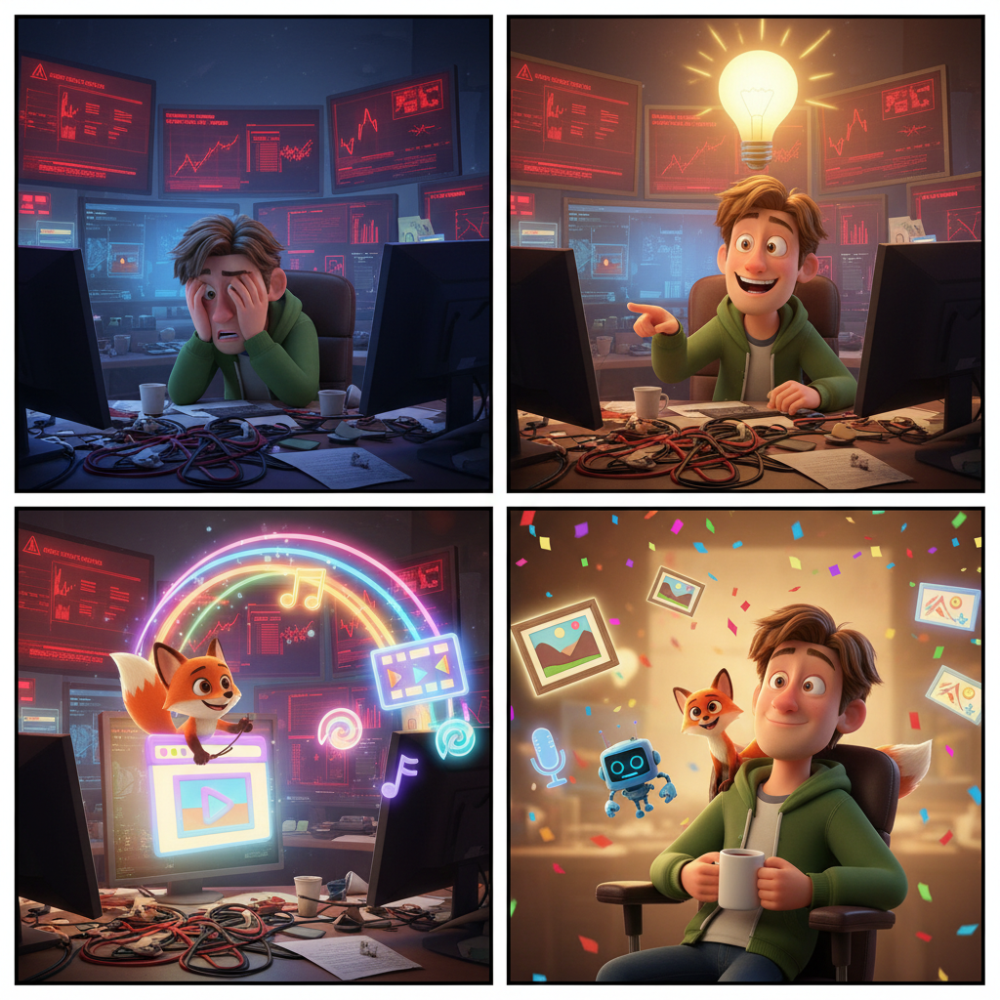

# GAIA — Google AI Automation

<p align="center">
  
</p>

GAIA drives Google's creative AI — **Gemini, Flow, NotebookLM** — to generate
**text, images, video, music, slides and podcasts**, with **no API keys**: it just
uses your **logged-in Firefox/Google session**, through **Camoufox** (an anti-detect
Firefox build) + Playwright.

- **Gemini** — text→image, image→video and text→video (Veo)
- **Flow** — Veo film clips in a Flow project (Nano Banana edits, Veo 3, Omni agent)
- **NotebookLM** — create notebooks, add/discover sources, generate & download
  **Audio Overviews (podcasts)** and **Slide Decks** in any language, with steering prompts
- **Music** — Gemini "Create music" / Labs MusicFX *(experimental)*

It does *not* copy your Firefox profile into Camoufox. It reads the Google cookies
from Firefox's `cookies.sqlite` once to bootstrap a **persistent, stable Camoufox
profile** (`.camoufox_profile/`) with a **pinned fingerprint** — after that GAIA
keeps its own session and your Firefox login is never touched again.

## ⚠️ Disclaimer

> [!CAUTION]
> **For personal and educational use only.** GAIA automates **your own**
> authenticated Google session. It is **NOT affiliated with, authorized by, or
> endorsed by Google**, and automating Google products may violate their Terms of
> Service — **use it at your own risk**: it can get your Google account
> rate-limited or **suspended**. Use only your own account, **one session at a
> time**; do **NOT** run it as a hosted service, a bot farm, or against accounts
> you do not own. Provided **AS IS, without warranty of any kind**.
>
> 🇷🇺 Только для личного и образовательного использования: вы автоматизируете
> собственную сессию Google и действуете на свой страх и риск (возможны
> ограничения или блокировка аккаунта).

## Requirements

> [!IMPORTANT]
> **Use Python 3.11, 3.12, or 3.13 — not 3.14.** Camoufox `0.4.11` (the latest
> release) supports **Playwright ≤ 1.51** only. On Python 3.14, pip refuses to
> install a compatible Playwright (the required old `greenlet` won't build), and
> forcing a newer Playwright (1.6x) breaks the browser launch with
> `Browser.setDefaultViewport ... "isMobile" ... not described in this scheme`.
> `requirements.txt` pins Playwright to a working range; create the venv with a
> supported interpreter, e.g. `python3.11 -m venv venv`.

## Setup

```bash
python3.11 -m venv venv && source venv/bin/activate   # Python 3.11–3.13, NOT 3.14
pip install -r requirements.txt
python3 -m camoufox fetch            # one-time: download the Camoufox browser

# One-time: establish the persistent session (bootstrap from Firefox cookies)
python3 login_camoufox.py --bootstrap
# (or `python3 login_camoufox.py` and sign into Google in the Camoufox window)
```

> **Single-session rule:** GAIA uses ONE Google account. Run only **one** Camoufox
> at a time — never several in parallel. Each launch with a different fingerprint
> looks like a new device; concurrent/many-fingerprint use makes Google invalidate
> the session (logging you out). The pinned fingerprint + persistent profile above
> prevent that.

## Files

| File | Purpose |
|------|---------|
| `login_camoufox.py`   | **One-time setup**: bootstrap the persistent Camoufox session (from Firefox cookies or a manual sign-in) |
| `gemini_image_gen.py` | Text → image: send prompt, download image(s) — **verified** |
| `gemini_video_gen.py` | Image→video **and** text→video (Veo): optional image + prompt, download `.mp4` — **verified** |
| `flow_gen.py`         | Google **Flow** (Veo): drive the Omni agent in a project (prompt → Approve → clip), download `.mp4` — **verified** |
| `notebooklm_gen.py`   | NotebookLM: create notebook, add/discover sources, generate & download **Audio Overview + Slide Deck** in any language — **verified** |
| `youtube_upload.py`   | YouTube Studio: upload a video with title/description/tags/thumbnail, audience + visibility, from a `video_maker` metadata JSON — no Data API |
| `music_gen.py`        | Music: Gemini "Create music" / Labs MusicFX — *built, not yet verified end-to-end* |
| `gemini_common.py`    | Shared helpers: persistent launch, cookies, prompt editor, screenshots |
| `cookies_firefox.py`  | Extract & convert Firefox cookies → Playwright format |
| `explore.py`          | Dev tool: deep-walk the DOM (incl. shadow roots) to find selectors if the UI changes |
| `prompts/*.txt`       | Example prompts (image, motion, text-video, flow) |
| `output/`             | Saved media (images, videos, audio, slide-deck PDFs) |
| `debug/`              | Step screenshots (only with `--debug`) |

## Usage

```bash
# Example prompt, default profile (default-release), visible window
python3 gemini_image_gen.py --prompt-file prompts/example.txt

# Inline prompt
python3 gemini_image_gen.py --prompt "a red fox in deep snow, cinematic, 16:9"

# Pick a different Firefox profile (name, dir name, or full path)
python3 gemini_image_gen.py --profile "Профиль 3" --prompt-file prompts/example.txt

# Debugging: save step screenshots and keep the window open at the end
python3 gemini_image_gen.py --prompt-file prompts/example.txt --debug --keep-open
```

### Options

| Flag | Default | Meaning |
|------|---------|---------|
| `--profile`     | `default-release` | Firefox profile logged into Gemini (name / dir / path) |
| `--prompt`      | — | Inline prompt text |
| `--prompt-file` | — | Read the prompt from a file (use this for multi-line prompts) |
| `--headless`    | off | Run with no visible window (visible is more reliable with Google) |
| `--timeout`     | `240` | Max seconds to wait for image generation |
| `--quiet`       | `8` | Seconds of no new images before generation is considered finished |
| `--keep-open`   | off | Leave the browser open after finishing (Ctrl+C to quit) |
| `--debug`       | off | Save `debug/NN_*.png` screenshots at each step |

Exit codes: `0` ok · `2` no prompt · `3` not logged in · `4` editor/input problem ·
`5` no images produced.

## Video (image → video, or text → video)

Gemini makes a video in a **fresh chat**. `gemini_video_gen.py` supports both:
- **image → video**: attach a source image + a motion prompt (`--image`),
- **text → video**: prompt only (omit `--image`; make the prompt explicitly ask
  for a video, e.g. "Generate an 8-second cinematic video: …").

It downloads the resulting `.mp4`.

```bash
# image -> video: animate an image with a motion prompt
python3 gemini_video_gen.py --image output/20260531_201357_1.png --prompt-file prompts/motion.txt

# text -> video: prompt only
python3 gemini_video_gen.py --prompt-file prompts/video_text.txt --debug

# inline prompt
python3 gemini_video_gen.py --prompt "Generate a video: a red fox running through deep snow, slow-mo, 16:9"
```

### Video options

| Flag | Default | Meaning |
|------|---------|---------|
| `--image`       | *(none)* | Source image to animate (image→video). Omit for text→video |
| `--prompt` / `--prompt-file` | — | Motion/animation prompt |
| `--profile`     | `default-release` | Firefox profile logged into Gemini |
| `--timeout`     | `600` | Max seconds to wait for the video (Veo takes ~1–3 min) |
| `--quiet`       | `10` | Seconds of no change before the video is considered done |
| `--video-tool`  | off | Open the dedicated "Create video" *studio* instead (experimental; the default plain chat flow is what works) |
| `--headless` / `--keep-open` / `--debug` | off | Same as the image script |

Exit codes: as above, plus `6` could not attach the image. Output: a 720p, ~10s
H.264+AAC `.mp4` in `output/`.

> The composer's **"Create video"** menu item opens a *separate* full-screen video
> studio (templates, Gemini Omni) — that's **not** needed and is avoided by default.
> Just uploading the image + a motion prompt in a normal chat triggers Veo inline
> ("Your video is ready!"). `--video-tool` is only there if you want the studio.

## Flow (Veo clips in a Flow project)

`flow_gen.py` drives **Google Flow** (labs.google/fx/tools/flow). On this account a
project opens the **"Omni" agent** (a chat panel), and generation is **gated by an
"Approve" button**: you send a request, the agent proposes a clip, you Approve, and
Veo renders 1–2 clips into the media grid. The script does all of that and
downloads a clip.

```bash
python3 flow_gen.py --prompt "a red maple leaf spinning as it falls, cinematic, 16:9"
python3 flow_gen.py --prompt-file prompts/flow.txt --project <url-or-id> --debug
python3 flow_gen.py --prompt "x" --explore --no-send --keep-open   # inspect the UI
```

Key flags: `--project` (URL or bare id; or set GAIA_FLOW_PROJECT), `--mode`
(`auto`/`agent`/`classic`), `--keep-session` (don't start a fresh agent chat),
`--timeout`, `--debug`. Output: a 720p ~10s `.mp4` in `output/`. Verified: prompt →
Approve → clip downloaded from the `labs.google/fx/api/.../media…` URL via
`context.request`.

## NotebookLM (podcasts & slide decks)

`notebooklm_gen.py` creates a notebook, adds sources, and generates **Audio
Overviews (podcasts)** and **Slide Decks** via their Customize popovers — in any
output language and with a steering prompt — then downloads the `.m4a` / `.pdf`.

```bash
# Paste text as a source, make a Russian audio overview with a focus prompt
python3 notebooklm_gen.py --source-text "..." --audio --language Russian \
    --instructions "Focus on the engineering challenges"

# Let NotebookLM web-search its own sources, then make audio + slides
python3 notebooklm_gen.py --discover "history of the Voyager program" --audio --slides

# Add files as sources (PDF/audio/etc. uploaded; .txt/.md/.csv pasted)
python3 notebooklm_gen.py --source-file paper.pdf --slides --slides-prompt "10 concise slides"

# Operate on an existing notebook / just re-download ready artifacts
python3 notebooklm_gen.py --notebook <url> --download-only --audio --slides
```

Sources: `--source-text`, `--source-url` (×N), `--source-file` (×N),
`--discover "query"`. Artifacts: `--audio`, `--slides`, `--language`,
`--instructions`, `--slides-prompt`, `--audio-format` (Deep Dive/Brief/Critique/
Debate), `--audio-length` (Short/Default/Long). Verified: an ~18-min Russian
Audio Overview (`.m4a`) and a 5-page Slide Deck (`.pdf`).

### Slide-deck quality checks (optional)

NotebookLM occasionally (a) slips a **Ukrainian-only letter** (`і ї є ґ`) into a
"Russian" slide, or (b) invents a **fake decorative QR code** (always bogus). Two
opt-in checks run after the slides download and **exit `9`** if they trip, so you
can regenerate:

```bash
python3 notebooklm_gen.py --source-file article.ru.md --slides \
    --language Russian --check-ru-slides --check-qr
```

- `--check-ru-slides` — OCRs each page (`tesseract -l eng+rus+ukr`) and reports
  words containing Ukrainian-only letters. Requires `pdftoppm` + `tesseract` with
  the `rus` & `ukr` language packs. (OCR of stylized Latin text can add a few
  false positives — the offending words are logged so you can judge.)
- `--check-qr` — renders each page and flags any that contain a **decodable** QR
  code (`cv2.QRCodeDetector`). Requires `pdftoppm` + `opencv-python-headless`.

## YouTube upload (no Data API)

`youtube_upload.py` drives **YouTube Studio** (studio.youtube.com) through the same
logged-in Camoufox session — Create → Upload videos → fill Details → set
visibility → Save. No Data API, no OAuth, no API keys. Point `--metadata` at the
JSON that `video_maker` emits (`{title, description, tags[]}`); explicit flags
override it. **Default visibility is `private`** — nothing goes public unless you
pass `--visibility public`.

```bash
# Upload a video_maker bundle as a private draft (safe default)
python3 youtube_upload.py \
    --video     ../marketmaker/video_maker/output/SLUG/SLUG.mp4 \
    --metadata  ../marketmaker/video_maker/output/SLUG/SLUG_metadata.json \
    --thumbnail ../marketmaker/video_maker/output/SLUG/SLUG_thumbnail.png \
    --visibility private --debug

# Fully manual, unlisted
python3 youtube_upload.py --video clip.mp4 --title "Hi" \
    --description "..." --tags "a,b,c" --visibility unlisted
```

Flags: `--video` (required), `--metadata`, `--thumbnail`, `--title`,
`--description`, `--tags` (comma-separated), `--visibility` (private/unlisted/
public), `--made-for-kids` (default: not for kids), `--timeout`, `--headless`,
`--keep-open`, `--debug`. Exit codes: `0` ok · `2` bad args · `3` not logged in ·
`4` couldn't start upload · `5` details step failed · `6` couldn't finish.

> Studio's web-component UI changes often; if a step misses, run with `--debug`
> and inspect `debug/yt_*.png` — each step is screenshotted, and failures emit a
> shadow-DOM deep-dump of the live controls.

## How it works

1. **Cookies** — `cookies_firefox.py` copies `cookies.sqlite` (+ WAL journal) so it
   reads even while Firefox is open, pulls every `*.google.com` cookie, and
   normalizes them: this Firefox build stores `expiry` in **milliseconds** (auto
   converted to seconds), and all cookies are mapped to `SameSite=Lax` (every
   `*.google.com` host is same-site for the Gemini app, so Lax is always sent and
   avoids Playwright's `SameSite=None`-requires-`Secure` rule).
2. **Launch** — `make_camoufox()` opens a **persistent** Camoufox context with a
   **pinned fingerprint** (`.camoufox_profile/` + `.camoufox_fp.pkl`). Firefox
   cookies are injected only to bootstrap the first run; afterwards GAIA reuses its
   own session, so the same device is presented every time and your Firefox login
   is never disturbed again.
3. **Prompt** — the Quill `contenteditable` editor is filled via Playwright
   `fill()` (bypasses the entry-animation overlay that intercepts real clicks and
   handles multi-line without an early send), then `Enter` submits.
4. **Capture (image)** — polls the DOM for new large images from Google's CDN /
   blob URLs until they stop changing. Gemini serves generated images as `blob:`
   URLs that it **revokes** right after the `` loads, so they're extracted
   from the already-decoded `` via a **canvas → PNG** dump at full native
   resolution (with an element-screenshot fallback for any CORS-tainted image).
5. **Video flow** — the composer loads as a collapsed "Ask Gemini" splash, so the
   script focuses the editor to expand the full toolbar, opens **"Upload & tools"
   → "Upload files"** (a native file chooser, intercepted with
   `expect_file_chooser`), fills the motion prompt, and **clicks Send, verifying
   the composer actually cleared** (with an attachment the Send button stays
   disabled until the upload finishes). It then polls for the result `<video>` and
   downloads its `*.usercontent.google.com` URL via Playwright's
   **APIRequestContext** (`context.request.get`), which carries the session
   cookies and bypasses page CORS.

## Notes & limitations

- Gemini's UI selectors can change; if the input isn't found, run with `--debug`
  and inspect `debug/03_before_type.png` (image) or `debug/13_ready_to_send.png`
  (video). `explore.py` deep-dumps the live DOM (including shadow roots) to find
  new selectors.
- The UI on this account renders in **English** (aria-labels like "Upload & tools",
  "Send message", "Create video"), even though the OS/profile is Russian.
- Video generation needs Veo access on the account; "No video detected" usually
  means a quota/limit or a changed UI — check `debug/20_result.png`.
- "No text" in a prompt is a *request* to the model — Gemini may still render
  labels. That's model behavior, not a script bug.
- If you see "not logged in", the chosen profile's Google session may be expired
  or it's a different account — pick another `--profile`.
- Keep the session/cookies private; they grant access to the Google account.

## License

[MIT](LICENSE) — fork it and adapt to your brand with any AI agent. See the
**Disclaimer** above: personal/educational use, your own account, at your own risk.
